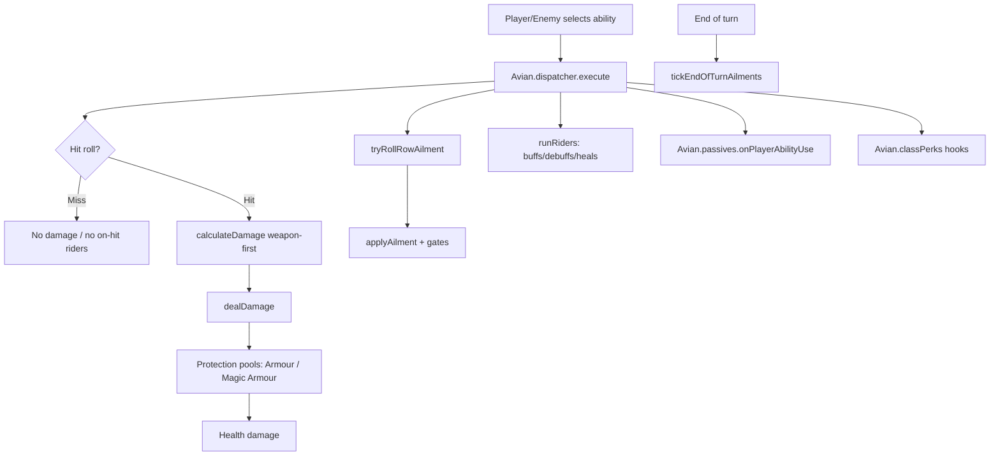

# Combat Interaction Audit

Reference map of Player, Enemy, and Bird interactions in combat: damage, percentages,
ailments, buffs/debuffs, chance rolls, and perk/passive application.

**Canonical tuning lives in data files** — this document describes behavior and points
to sources. Do not duplicate numeric tables here; read `js/data/combat-config.js` and
`js/data/ailment-rules.js` for live values.

---

## Architecture



| Layer | Primary files |
|-------|---------------|
| Ability execution | `js/systems/ability-dispatcher.js` |
| Damage math | `js/systems/combat-formulas.js`, `js/data/combat-config.js` |
| Combat glue | `js/core/game.js` |
| Ailment ticks | `js/systems/ailment-engine.js`, `js/data/ailment-rules.js` |
| Protection | `js/systems/protection-pools.js`, `js/data/equipment/ailment-gates.js` |
| Passives | `js/data/combat-pack/bird-passives.js`, `js/systems/passive-hooks.js` |
| Class perks | `js/data/combat-pack/classes.js`, `js/systems/class-perk-runtime.js` |
| Effect tiers | `js/data/effect-tiers.js` (Minor ±4, Moderate ±10, Major ±20) |

Player abilities route through `Avian.dispatcher.execute()`. Legacy `ACTIONS` handlers
in `game.js` are boot-time proxies only.

---

## DoT tick path (authoritative)

**Only** `tickEndOfTurnAilments(side)` in `js/systems/ailment-engine.js` delivers
ailment DoT damage. It uses MaxHP%-based helpers from `js/data/ailment-rules.js` and
`applyAilmentDamage()`.

Call sites in `js/core/game.js`:

- `endPlayerTurn()` → `tickEndOfTurnAilments('player')`
- `afterEnemyTurn()` → `tickEndOfTurnAilments('enemy')`

Legacy flat-formula helpers (`tickDoTs`, `tickPoisonDamageOnly`,
`tickBurningEndEnemyPhase`, `tickPoisonDurationEndRound`) were removed — they were
never called and contradicted the MaxHP% model.

Delayed damage uses `tickDelayedForTarget()` separately (stores % of hit, detonates
end of next turn).

---

## Damage system

### Weapon-first formula (active)

```
Pre-mitigation = Weapon × ((SkillPower% + Stat × 2.5) ÷ 100)
```

- Stat contribution: **2.5%** of weapon damage per scaling stat point.
- Basic Attack: 100% Skill Power from equipped weapon; unarmed Natural Strike is flat 1–2.
- Mitigation: `rating = EffDef × 2.5`; `mit% = rating / (100 + rating)`, cap **75%**.
- Minimum landed damage: **1** on successful hits.
- Penetration: flat first, then %; **40%** cap on percentage penetration.

### Damage paths

| Path | When used |
|------|-----------|
| **Master** | `computeMasterOutgoingDamage()` → `calculateDamage()` when `usesMasterDamage(row)` |
| **Legacy fallback** | `computeOutgoingDamageBase()` when master path unavailable |

Equipment skills use the master path. Crit, bonus fractions, and aspect mods are folded
into master path before `dealDamage()`.

### Aspect modifiers

From `js/data/aspects.js`: Dominant **×1.2**, Neutral **×1.0**, Resisted **×0.8**.

### Additive damage bonus cap

Bonuses stack additively as fractions, then capped via `getBonusCap()` in
`js/systems/combat-formulas.js`:

| Context | Cap |
|---------|-----|
| Default | **+30%** |
| Player has equipment damage bonuses (`detectEquipmentDamageBonus`) | **+45%** |
| Boss attacker | **+50%** |

Note: the 45% tier triggers when mechanics rollup reports `%` damage bonuses — not
mutations-only despite the internal field name `hasMutationEquipmentBonus`.

### Crit

| Parameter | Value |
|-----------|-------|
| Base crit mult | **×1.35** (floor) |
| Cap | **×2.0** |
| Crit chance cap | **50%** |

### Incoming damage modifiers

| Modifier | Effect |
|----------|--------|
| Guarded (Brace) | Physical × `(1 − bracePct/100)`, cap 12% |
| Defending | **×0.4** |
| Fear (attacker) | **×0.88** outgoing via `getFearDamageMult` |
| Iron Resolve (player) | **×0.80** incoming |
| Legacy bird resistances | `physicalResist`, `magicResist`, etc. |

### Fear + Terror Ledger stacking (intentional)

When a **Feared** enemy attacks a player with the **Terror Ledger** relic
(`relTerrorLedger`), both reductions apply in `dealDamage()` (~14116–14118):

1. Relic: **×0.90**
2. Fear ailment: **×0.88** via `getFearDamageMult(enemyStatus)`

Compound: ~**×0.792** (~21% total reduction). This is intentional — do not dedupe.

---

## Hit, dodge, accuracy

```
Hit% = clamp(Final Attack Precision − Target Dodge − skillPenalty, 15, 95)
```

- Heavy skills (EN ≥ 3): accuracy penalty from skill precision or inferred ability power.
- Dodge from Agility: **+0.5%** per point, cap **50%**.
- **Immobilised**: dodge forced to 0.

Chance primitive: `chance(p) → Math.random() * 100 < p`.

---

## Ailment application

### Chance resolution

```
adjusted = base + magicShift + controlBoost + passiveBonus + equipmentBonus + classPerkBonus
finalChance = max(5, adjusted − targetResist)   // unless deterministic 100%
```

- **Magic shift**: `(attacker MATK − target MDEF) × 1.5`
- **Tier resist**: common 0, strong 8, elite 12, boss 20, duke 30
- **Deterministic on land**: authored 100% skips tier resist

### Application caps

| Cap | Value |
|-----|-------|
| Stacks per action | 2 |
| Stacks per turn | 4 |

### Protection-pool gates

See `js/data/equipment/ailment-gates.js`. Summary:

| Family | Pool required |
|--------|---------------|
| Bleed, Fracture, Crippled, Dazed, physical debuffs | Armour |
| Burn, Poison, Chilled, Shock, magic debuffs | Magic Armour |

Bypass/pierce damage alone does **not** bypass gates.

### Stacking → resolved states

| Base | At cap → | Resolved |
|------|----------|----------|
| Poison (5 stacks) | Toxic | 5% MaxHP, 2 turns |
| Bleed (3 stacks) | — | −10% healing/stack |
| Burning (5 stacks) | Incinerating → Scorched | Minor Guard/Resolve Down |
| Chilled (5 stacks) | Frozen | Skip action + Control Resistance |
| Shock (5 stacks, 0 Magic Armour) | Paralysed | +1 EN/skill, then CR |
| Fracture (5 stacks, 0 Armour) | Shattered | −10 Guard, −25% armour restore |
| Crippled (5 stacks, 0 Armour) | Immobilised | Dodge 0, blocks mobility |
| Dazed (5 stacks, 0 Armour) | Concussed | −20 Precision, −15 Skill Power, +1 EN |

Full per-stack values: `js/data/ailment-rules.js`, synced from `js/data/combat-config.js`.

### DoT tick formulas (engine)

| Ailment | Tick |
|---------|------|
| Poison | MaxHP × 0.0075 × stacks |
| Toxic | MaxHP × 0.05 |
| Bleed | MaxHP × 0.01 × stacks |
| Burning / Shock | MaxHP × 0.01 × stacks |
| Incinerating | MaxHP × 0.06 |

Ailment damage bonus cap: **+25%** (`AILMENT_DAMAGE_BONUS_CAP`).

---

## Buffs and debuffs

Flat tiers from `js/data/effect-tiers.js`: Minor **±4**, Moderate **±10**, Major **±20**.

- Stat modifiers: default **1 turn**; same-source refresh replaces.
- Ailments: multi-turn; duration extended by Cursed Call (+1 turn) and Resonant Hex (+1 on stat debuffs).

---

## Class perks

Defined in `js/data/combat-pack/classes.js`, runtime in `js/systems/class-perk-runtime.js`.

| Class | Perk | Effect |
|-------|------|--------|
| Knight | Bulwark Oath | After Fortify/Armour Restore: +4 Guard (once/turn) |
| Rogue | Rogue Tempo | Acting first, WS1: +10 Precision; on Armour break: +4 Agility |
| Mage | Arcane Pressure | First magic weapon skill/turn: +10% damage to Magic Armour only |
| Siren | Cursed Call | After Magic Armour break: +10% app chance, +1 debuff turn |
| Inquisitor | Judgement Leech | Health hit on ailmented/debuffed/Marked: restore 2 lower pool or 5% heal |
| Bard | Verse and Chorus | Alternate Martial/Magic: 2nd skill restores pool or +10 Skill Power |
| Brute | Crushing Momentum | After Armour absorb: next Strength skill +10 Skill Power |
| Duke | Duke Ascension | On kill: 25% pool restore, +5% all damage (stacks) |

---

## Bird passives

44 species in `js/data/combat-pack/bird-passives.js`. Runtime via `Avian.passives` in
`js/systems/passive-hooks.js`. Legacy hardcoded hooks in `game.js`
(`getPlayerCritChance`, `collectOutgoingDamageBonusFractions`) coexist until full excise.

Common effect types: flat penetration, Skill Power vs pool, pool restoration, ailment
app chance bonus, armour/magic armour damage.

---

## Player ↔ Enemy matrix

| Interaction | Player → Enemy | Enemy → Player |
|-------------|----------------|----------------|
| Damage | dispatcher → calculateDamage → dealDamage | enemyTurn → dealDamage |
| Hit | Player Precision − enemy Dodge | Enemy Precision − player Dodge |
| Ailments | tryRollRowAilment + gates | Same |
| Protection | Armour / Magic Armour routing | Same |
| Passives | Species + Endless + equipment | Workbook enemy passives |
| Class perks | 8 classes active | Enemies inherit class from roster |

---

## Verification

- `npm test` — full CI chain including combat scenarios
- Scenarios: `scripts/combat-scenarios/scenarios/{damage,ailments,buffs-debuffs,passives,class-perks}.mjs`
- Unit checks: `scripts/verify-ailment-engine.mjs`, `scripts/verify-combat-damage-formula.mjs`

---

## Out of scope / known coexistence

- Master vs legacy damage fallback — by design for non-equipment rows.
- Legacy species hooks alongside v2 passive router — intentional until excise.
- `getShockPrecisionPenalty` helper exists but Shock no longer applies precision penalty in v0.6.
